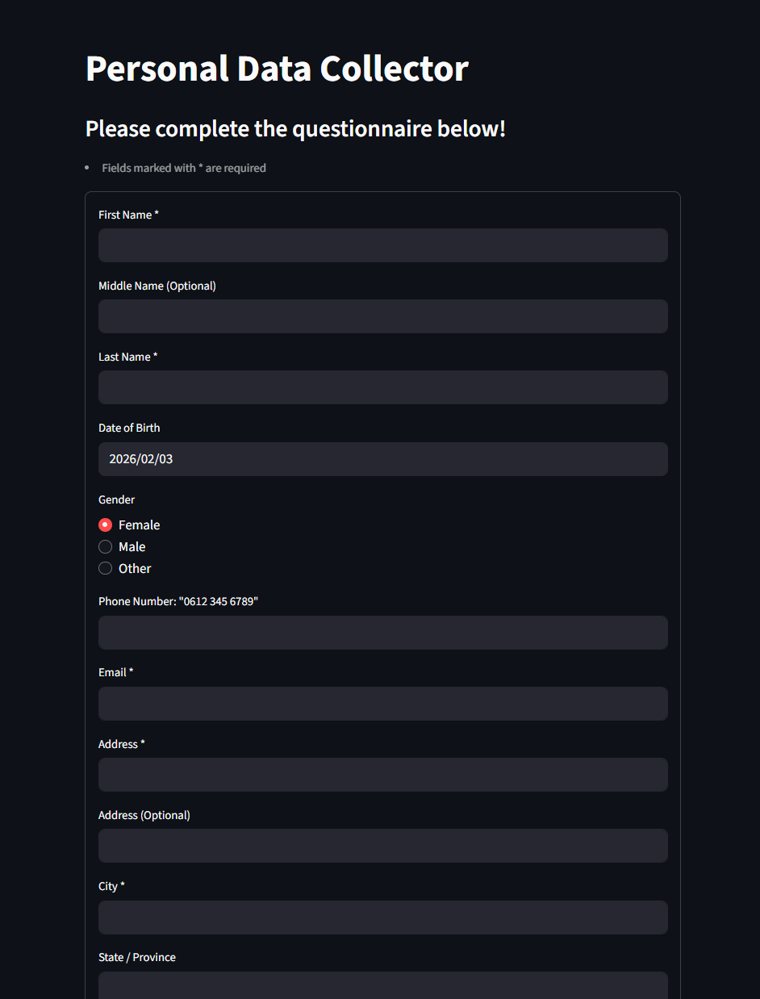
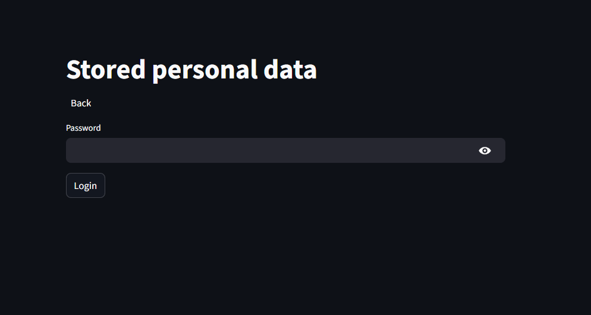
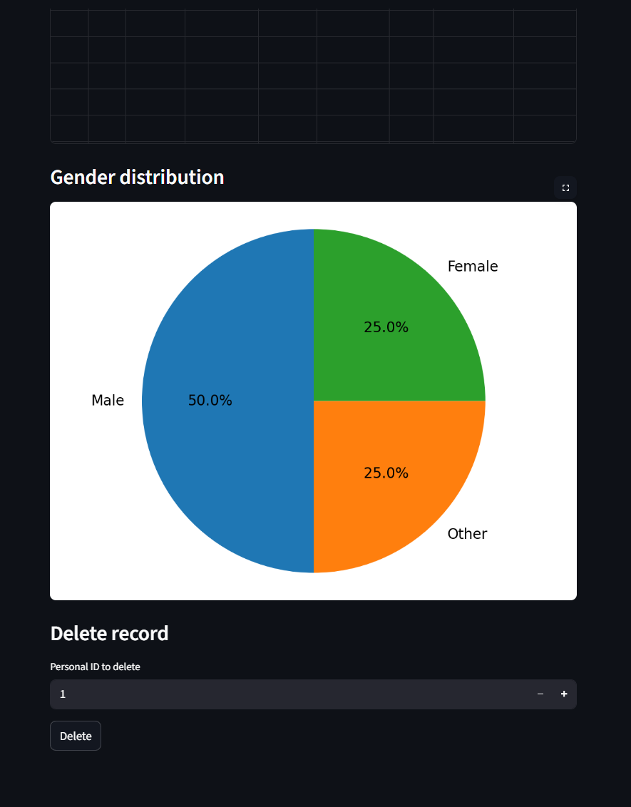

# streamlit-sql-survey-app
Streamlit-based survey application that collects questionnaire data and stores it in a SQL database. Focuses on clean data collection, validation, and a simple analytics-ready structure. Built as a portfolio project demonstrating Python, Streamlit, and SQL integration.

# 🧾 Personal Data Collector

A simple but production-style Streamlit questionnaire app that collects personal information and stores it in a structured SQL database.

## 🚀 Features

- Interactive Streamlit form
- Required field validation
- Email format checking
- Multi-table SQL storage (personal, address, education, employment)
- Consent-based submission
- Data listing page

## 🛠 Tech Stack

- Python
- Streamlit
- SQL database
- Pandas

## 💡 Why this project?

Built to practice:
- form handling
- input validation
- clean data modeling
- database operations
- real-world data collection workflows

Perfect foundation for analytics or admin dashboards.

## 📸 Screenshots

### 📝 Form page

### ✅ Admin client login

### 📊 Stored data visualisation

(No real user data is included in this repository.
Database credentials and sensitive information are managed via environment secrets.)
